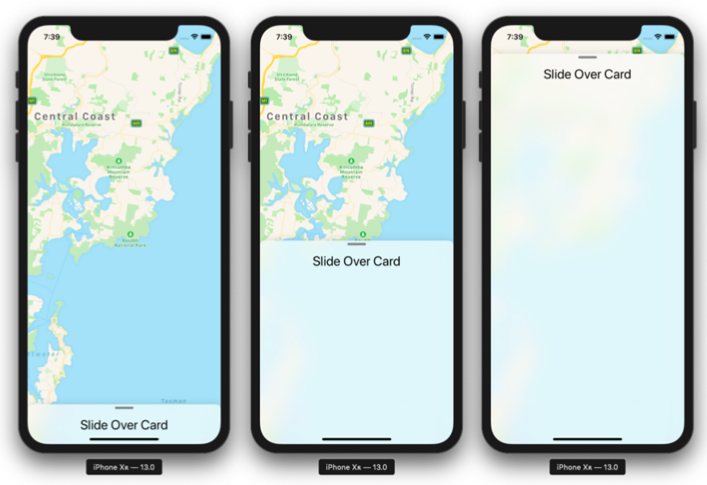
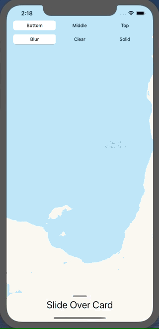

# Slide Over Card for SwiftUI




## Installation with Swift Package Manager

Swift Package Manager is integrated within Xcode 11:

1. File → Swift Packages → Add Package Dependency...
2. Paste the repository URL: https://github.com/ziligy/swiftUI-slide-over-card.git

## Set Slide position

By default the slide is in `.middle` position. If you want to change it, set like:

```swift
SlideOverCard(.bottom) { // or .middle, .top
    VStack {
        Text("Slide Over Card").font(.title)
        Spacer()
    }
}
```

## Set Background Style

By default background is 'solid'. If you want to change it for blur or clear, set like:

```swift
SlideOverCard(backgroundStyle: .blur) { // or .clear or .solid
    VStack {
        Text("Slide Over Card").font(.title)
        Spacer()
    }
}
```

## Usage

```swift
import SwiftUI
import MapKit
import SlideOverCard // Add import

struct ContentView : View {
    var body: some View {
        ZStack(alignment: Alignment.top) {
            MapView()
            // Set your card
            SlideOverCard {
                VStack {
                    Text("Slide Over Card").font(.title)
                    Spacer()
                }
            }
        }
        .edgesIgnoringSafeArea(.vertical)
    }
}

struct MapView : UIViewRepresentable {
    
    func makeUIView(context: Context) -> MKMapView {
        MKMapView(frame: .zero)
    }
    
    func updateUIView(_ view: MKMapView, context: Context) {
        let coordinate = CLLocationCoordinate2D(latitude: -33.523065, longitude: 151.394551)
        let span = MKCoordinateSpan(latitudeDelta: 0.2, longitudeDelta: 0.2)
        let region = MKCoordinateRegion(center: coordinate, span: span)
        view.setRegion(region, animated: true)
    }
}

```

## Thanks

* To @mshafer for the [snippet](https://gist.github.com/mshafer/7e05d0a120810a9eb49d3589ce1f6f40)
* To @cyrilzakka for the [sample](https://github.com/cyrilzakka/SwiftUIModal)
